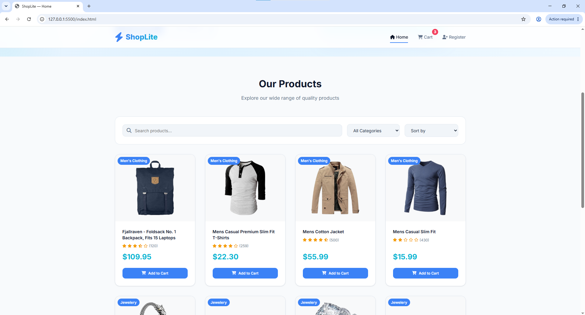
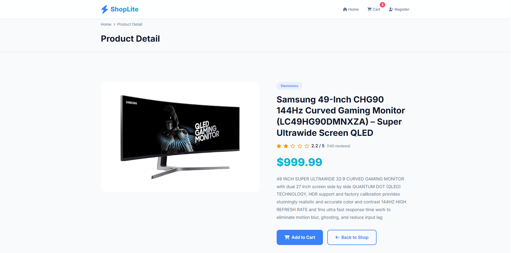
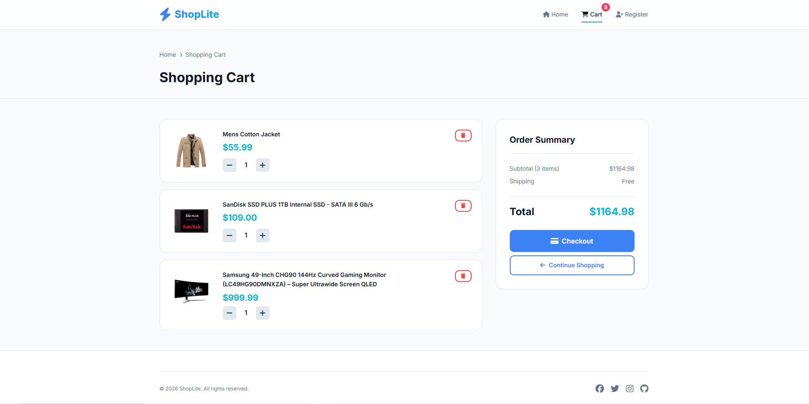
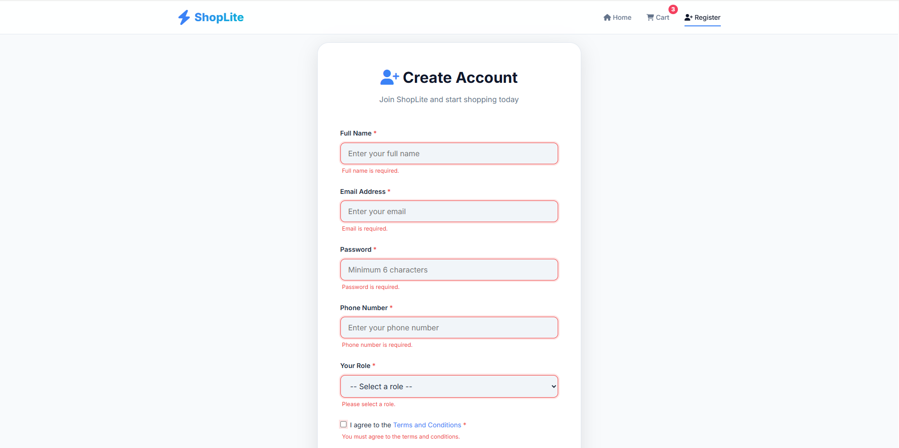

# ShopLite — Mini E-Commerce Website

> A multi-page shopping website built with vanilla HTML, CSS, and JavaScript. Product data is fetched from the [Fake Store API](https://fakestoreapi.com/).

## 📸 Screenshots






## 🚀 Features

### Pass Tier
- 4 pages linked via shared navbar (Home, Product Detail, Cart, Register)
- Semantic HTML (`header`, `nav`, `main`, `section`, `footer`, `article`)
- Home page fetches and renders product list with DOM
- Detail page displays correct product by `id` (via query string)
- Registration form with JavaScript validation (required fields, email format)
- Basic responsiveness — no layout breakage on mobile

### Good Tier
- Full cart: add/remove/change quantity, total, stored in `localStorage` across pages
- Search and filter by category, updating the grid immediately
- Loading and error states (spinner, error message, retry button)
- Hand-written Flexbox/Grid, smooth responsiveness at 3 breakpoints (desktop/tablet/mobile)

### Excellent Tier
- Event delegation for product grid and cart (one listener on parent)
- Product sort (price up/down, name A-Z/Z-A) + combined search + filter + sort
- Cart count badge on navbar, synced across pages
- Pagination for the product list

## 🗂️ Folder Structure

```
fef-shoplite/
├── index.html          # Home / Product list
├── product.html        # Product detail
├── cart.html           # Shopping cart
├── register.html       # Register / Contact form
├── css/
│   └── style.css       # All styles (hand-written CSS)
├── js/
│   ├── api.js          # Shared fetch functions
│   ├── cart.js          # Cart logic + localStorage
│   ├── home.js          # Home page logic
│   ├── product.js       # Product detail logic
│   └── register.js      # Form validation logic
├── assets/             # Images, icons
└── README.md
```

## 🛠️ How to Run Locally

1. Clone the repository:
   ```bash
   git clone <your-repo-url>
   cd fef-shoplite
   ```

2. Open `index.html` in your browser:
   - Double-click `index.html`, or
   - Use a local server (recommended):
     ```bash
     npx serve .
     ```
   - Or use the VS Code "Live Server" extension.

3. No build step required — pure HTML/CSS/JS.

## 🌐 Data Source

All product data is fetched from **[Fake Store API](https://fakestoreapi.com/)**:
- `GET /products` — All products
- `GET /products/{id}` — Single product
- `GET /products/categories` — Category list
- `GET /products/category/{name}` — Filter by category

## 🔧 Technologies Used

- HTML5 (Semantic)
- CSS3 (Custom Properties, Flexbox, Grid)
- Vanilla JavaScript (ES6+, Fetch API, async/await)
- Font Awesome 6 (icons via CDN)
- Google Fonts (Inter)
- localStorage (cart persistence)
